# Phần mềm cân ACS
Phần mềm cân xe tải ACS là phần mềm cân xe tự động, có các tính năng sau:
- Quản lý xe ra/vào bằng module đăng ký xe nhập, đăng ký xe xuất:
- Quản lý kế hoạch nhập hàng: module đăng ký kế hoạch được vận hành bởi nhân viên phòng Thu Mua.
- Tự động nhận diện biển số xe.
- Cân nhập: tự động tính bì dựa theo công thức, tự động tạo phiếu nhập trên Bravo.
- Cân xuất: trừ bì tự động, quản lý hóa đơn bằng máy đọc mã vạch.
- Báo cáo: tự động xuất báo cáo tổng hợp, báo cáo chênh lệch thành phẩm.
Có hệ thống báo cáo nền web cho phép người quản trị kiểm tra báo cáo một cách tiện lợi.

## Cài đặt
Việc cài đặt được thực hiện theo yêu cầu từ bộ phận.  
- Địa chỉ bộ cài: `\\172.16.2.30\Setup\28_ACS`
    * Bộ cài cho module đăng ký xe (cài trên máy tính Bảo Vệ): `iTruk_HongHaFeed`
    * Bộ cài cho module cân nhập/xuất (cài trên máy tính trạm cân 100T, 80T): `Vtwv2_HongHaFeed`
- Cách cài đặt: bộ cài được thiết lập chế độ tự động.  
Trong mỗi thư mục bộ cài tồn tại file `setup.exe`, vui lòng click file này và chờ cho tới khi chương trình cài đặt xong.
- Key bản quyền (phần mềm ACS cần cung cấp key để active): vui lòng liên hệ `Mr.Cường - 0974 936 497` để được hỗ trợ.

## Cấu hình
### Cấu hình module Cân Xuất
File cấu hình đã được lưu trên hệ thống.  
Mỗi lần setup lại phần mềm, người dùng cần kiểm tra xem các cấu hình đã được áp dụng cho module Cân Xuất đúng chưa như ảnh dưới đây:  
\- Cấu hình kết nối COM:

\- Cấu hình đồng bộ dữ liệu:

\- Cấu hình nhóm người dùng:

\- Cấu hình người dùng:

\- Cấu hình camera:

\- Cấu hình cổng COM:

\- Cấu hình thông tin công ty:

\- Cấu hình cầu cân:

\- Cấu hình phần mềm cân:

\- Cấu hình email:

\- Cấu hình lịch gửi email tự động:

\- Cấu hình IO:

\- Cấu hình COM khác:

### Cấu hình module Cân Nhập
Tương tự như module Cân Xuất, sau khi cài xong phần mềm, người dùng cần kiểm tra thông tin cấu hình đã chính xác chưa như ảnh dưới đây:

## Tạo kế hoạch nhập hàng
Việc tạo kế hoạch nhập hàng được thực hiện bởi nhân viên phòng Thu Mua.  
Kế hoạch nhập hàng sẽ tạo dữ liệu đầu vào cho module `Đăng ký xe nhập`.
Chỉ các xe nằm trong `kế hoạch` mới được phép đăng ký.
::: warning
- Kế hoạch nhập hàng phải được tạo trước thời điểm 16:00.  
Sau thời điểm này, hợp đồng nào thêm vào được tính là `bổ sung`.
- Trường hợp xe vào nhập hàng mà không nằm trong kế hoạch, Bảo Vệ liên hệ nhân viên phòng Thu Mua để yêu cầu bổ sung xe vào `kế hoạch nhập hàng`.
:::
Sau đây là các bước thực hiện để tạo kế hoạch nhập hàng:
- B1: Truy cập phần mềm (giao diện web)  
  * Mở trình duyệt web (Chrome/Firefox/...), gõ địa chỉ: `172.16.2.50:1294`
  * Ấn nút enter để vào phần mềm.
  
- B2: Đăng nhập phần mềm  
  * Nhập `Tên đăng nhập` và `Mật khẩu`, sau đó ấn nút `Đăng nhập`.
  
- B3: Tạo kế hoạch  
  * Click `Kế hoạch > Lập kế hoạch`:
  
  * Ấn nút `Thêm mới`:
  
  * Chọn `Ngày kế hoạch` (là ngày nhập hàng), điền `Tên kế hoạch` và ghi chú (nếu cần thiết).  
  Sau đó ấn nút `Thêm mới`.
  
  ::: warning
  Bắt buộc phải chọn đúng `Ngày kế hoạch` và nhập `Tên kế hoạch`.  
  Trường `Ghi chú` có thể bỏ trống.
  :::
  * Ba nút dưới đây được dùng để `Tạo chi tiết kế hoạch`, `Sửa kế hoạch (sửa tên, ngày, ghi chú` và `Xóa kế hoạch`.
  
  * Ấn nút `Chi tiết kế hoạch` để thêm danh sách các xe sẽ nhập hàng (theo hợp đồng):
  
  * Ấn nút `Thêm mới`
  
  * Điền chính xác các thông tin và bấm nút `Thêm mới`:
  
  ::: warning
  Các trường có dấu sao màu đỏ (*) là `bắt buộc`.
  :::
  * Tiếp tục thêm các hợp đồng để hoàn thành `Kế hoạch nhập hàng`, trên phần mềm hỗ trợ tính năng `Sửa` hoặc `Xóa` cho từng hợp đồng.
  

## Đăng ký xe nhập
Theo quy trình cân khép kín, xe muốn vào nhập hàng cần được đăng ký ở cổng bảo vệ (Bảo Vệ khu B).
::: warning
- Xe chỉ được đăng ký khi đã có tên trong `Kế hoạch nhập hàng`.
- Trường hợp chưa có tên trong `Kế hoạch nhập hàng`, nhân viên Bảo Vệ liên hệ với nhân viên phòng Thu Mua để được bổ sung.
:::

Đăng ký xe nhập hàng bao gồm `Đăng ký vào` và `Đăng ký ra`.
Người dùng đăng nhập vào phần mềm `iTruck`, click `Xe ra vào > Đăng ký xe nhập`:

### Đăng ký vào
Trên giao diện `Đăng ký xe nhập`, nút tròn ở mục `Xe đã vào`, nhân viên Bảo Vệ cần điền đầy đủ `Biển số`, `Lái xe` và chọn hợp đồng trong danh mục. Cuối cùng ấn nút `Tạo mới` để hoàn thành.

::: warning
- `Biển số`: yêu cầu ngăn cách giữa phần `Mã tỉnh thành` và phần `Số` bằng dấu gạch giữa `-`.
- `Lái xe`: yêu cầu viết Tiếng Việt có dấu, phía sau ghi số điện thoại lái xe.
:::

### Đăng ký ra

### Sửa đăng ký
Vì một số nguyên nhân, thông tin đăng ký có thể bị sai:
- Sai biển số xe.
- Sai thông tin lái xe.

Trường hợp Bảo Vệ muốn sửa thông tin đã đăng ký, click vào xe đã được đăng ký, tiếp theo sửa các giá trị và ấn nút `Lưu phiếu` để cập nhật lại.

## Đăng ký xe xuất

## Cân nhập
### Khởi động chương trình cân
Click biểu tượng chương trình cân `VitruckWeigh`, đăng nhập với tài khoản được cấp:
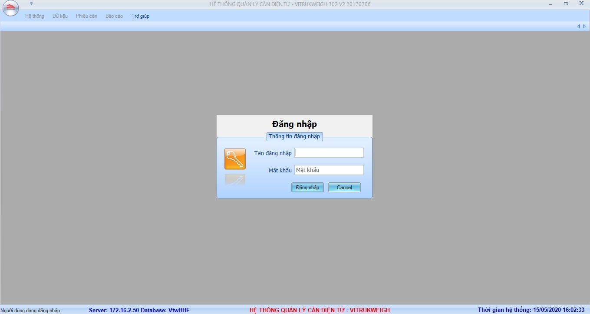
Người dùng click vào mục  `Phiếu cân > Phiếu cân nhập`. Giao diện cân nhập như hình bên dưới:
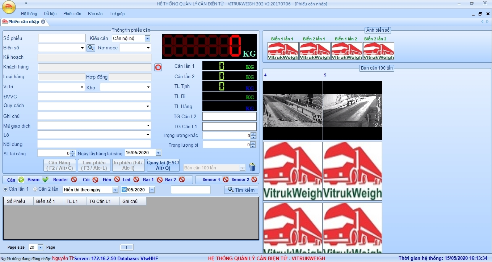
::: danger Chú ý
Khi màn hình hiển thị trọng lượng cân bằng 0 mới được phép tiến hành cân!
:::
### Kiểu cân
Cân nhập bao gồm 2 kiểu cân:
- `Cân nội bộ`: Cân nhập các xe nguyên liệu, nhiên liệu, bao bì, vi lượng, thuốc thú y đã có trong kế hoạch nhập.
- `Cân khác`: Cân các trường hợp không có trong kế hoach nhập hàng của phong thu mua như: cân thử cân, cân nhập gia công, cân nhập hàng thành phẩm trả về, cân nhập vật tư kho cơ khí v.v.v…
Sau đây là hướng dẫn chi tiết cho từng kiểu cân.
#### Cân nội bộ
- Cân lần 1:
  * Khi xe đã lên cân ổn định, bảo vệ báo đã kiểm tra xong thì nhân viên cân chọn vào cân hàng(F2).
  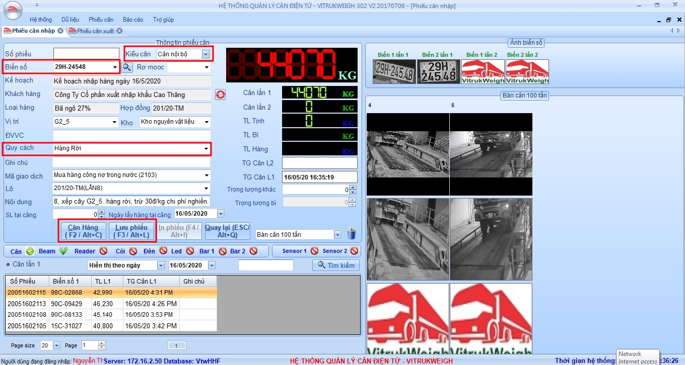
  * Sau đó người dùng điền giá trị cho `Quy cách`.  
  Người dùng cũng có thể điền trước các giá trị `Vị trí`, `Kho`, `Mã giao dịch`, `Lô`, `Nội dung`.
  Những giá trị này sẽ được dùng để cập nhật trực tiếp từ phần mềm cân ACS lên phần mềm kế toán Bravo.
  * Người dùng ấn nút `Lưu phiếu` để hoàn thành việc cân lần 1.
  ::: warning Chú ý
  Biển số này bình thường sẽ được phần mềm nhận diện tự động qua camera.  
  Tuy nhiên, một số trường hợp camera không nhận dạng được biển số xe(do biển số xe bị bẩn, mất nét, mờ hoặc do tác động khách quan như trời tối, nắng quá…vv) thì sau khi ấn cân xe(F2), ta chọn biển số xe thực tế đang trên cân theo xác nhận của bảo vệ và lưu phiếu cân.
  - Người dùng cần có động tác nhìn biển số ở camera bên phải giao diện và so sánh với biển số nhận dạng ra được.  
  - Nếu phát hiện bị sai, người dùng cần nhập tay giá trị này hoặc chọn luôn biển số đã đăng ký ở `Danh sách phiếu cân`.
  :::
  ::: danger Lỗi xảy ra
  Trường hợp xe chưa được đăng ký ở cổng Bảo Vệ hoặc đăng ký sai biển số xe, phần mềm cân sẽ báo lỗi.  
  Khi đó người dùng cần liên hệ với Bảo Vệ để đăng ký lại xe, sau đó cân bình thường.
  :::

- Cân lần 2:
  * Người dùng ấn `Quay lại (Esc)` để các trường thông tin trắng hết rồi mới thực hiện cân.
  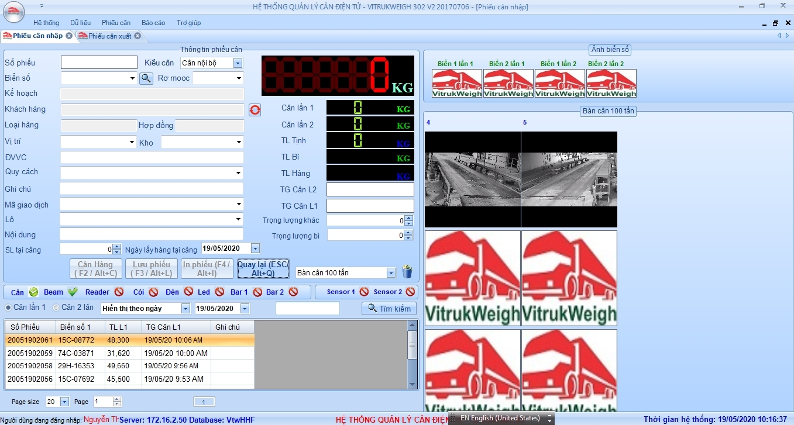
  * Xe lên cân lần 2 đã có hiệu lệnh của bảo vệ kiểm tra xong, nhân viên cân thực hiện `Cân hàng`.
  * Điền bổ sung các trường: `Vị trí`, `Kho`, `Mã giao dịch`, `Lô`, `Nội dung`, `SL tại cảng` và `Ngày lấy tại cảng` (nếu có), `Trọng lượng bì`, `Trọng lượng khác`.
  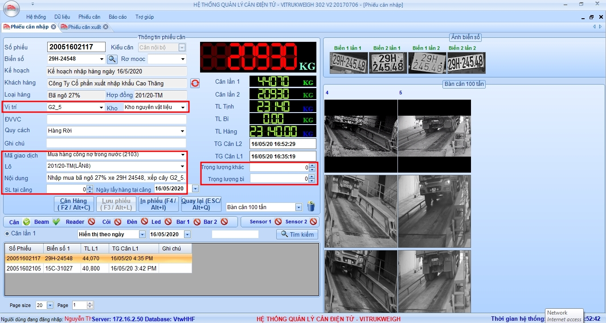
  * Sau khi kiểm tra lại 1 lượt thông tin đã chính xác, chọn `Lưu phiếu(F3)` > `In phiếu(F4)` > Chọn `Số bản muốn in(F3)`. Chọn `Đồng ý` hoặc `Hủy bỏ` việc in phiếu cân.
  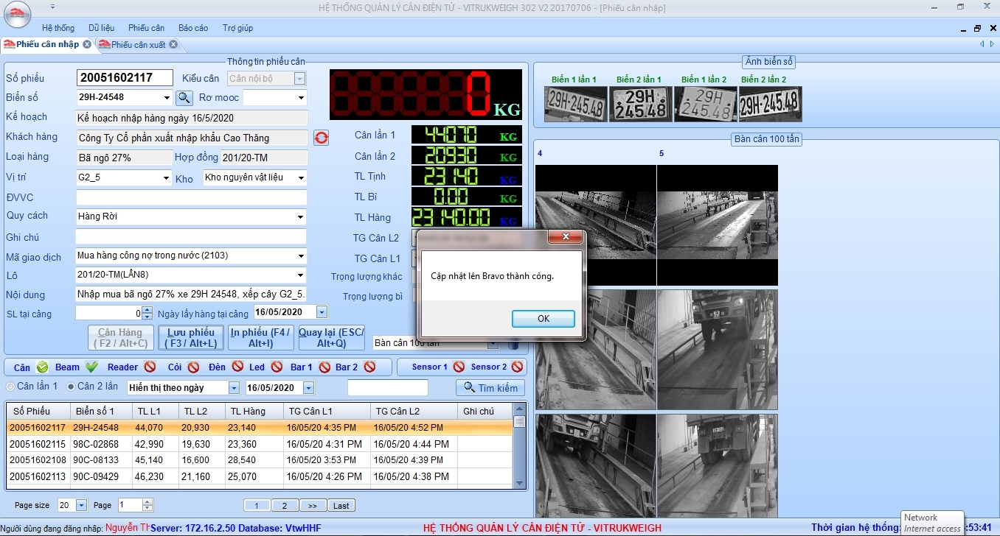
  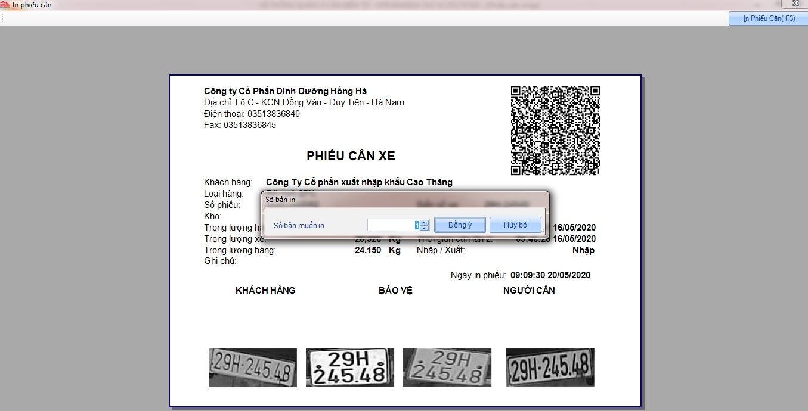
  ::: danger Lỗi xảy ra
  - Trường hợp phiếu lưu sang Bravo bị lỗi, phần mềm sẽ hiển thị thông báo.  
  Bạn vui lòng kiểm tra lại các trường thông tin đã nhập vào trên phiếu cân lần 2.
  - Các trường thông tin `Mã lô`, `Vị trí` bắt buộc phải được tạo trước trên phần mềm Bravo.
  :::
  ::: warning Chú ý
  Khi xe ra cân lần 2(đã có kiểm tra xác nhận của bảo vệ), chọn cân xe(F2) ->chọn biển số xe thực tế cân đã lưu lần 1 ở dưới, nhập đầy đủ các thông tin còn thiếu như trường hợp xe nhận dạng được biển số.
  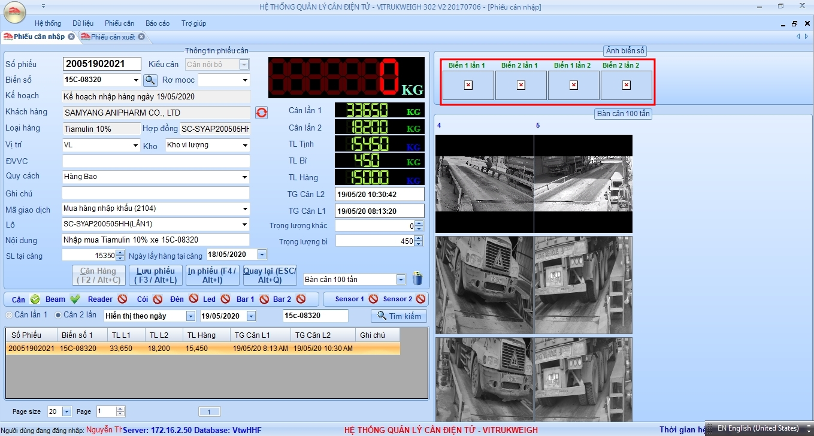
  :::

#### Cân khác
Thực hiện tương tự như `Cân nội bộ`.
- Cân lần 1: người dùng ấn `Cân hàng(F2)` > chọn kiểu `Cân khác`> nhập thông tin cần thiết như: `Khách hàng`, `Loại hàng`, `Ghi chú`..vv > ấn `Lưu phiếu(F3)`.
- Cân lần 2: `Cân hàng(F2)` > `Lưu phiếu(F3)` > `In phiếu(F4)`.

## Cân xuất
Tính năng cân xuất hàng được sử dụng trong các trường hợp sau:
- Cân xuất thành phẩm.
- Cân xuất nguyên liệu để sản xuất, cân bán phế liệu ...

Sau khi đăng nhập vào chương trình cân `ViTrukWeigh` với tài khoản được cấp, người dùng click vào mục `Phiếu cân > Phiếu cân xuất`.
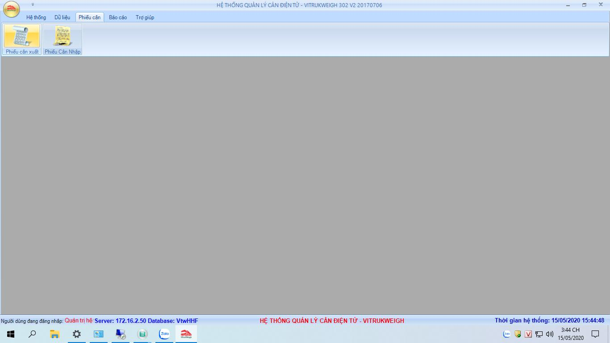
Giao diện module cân xuất như bên dưới:
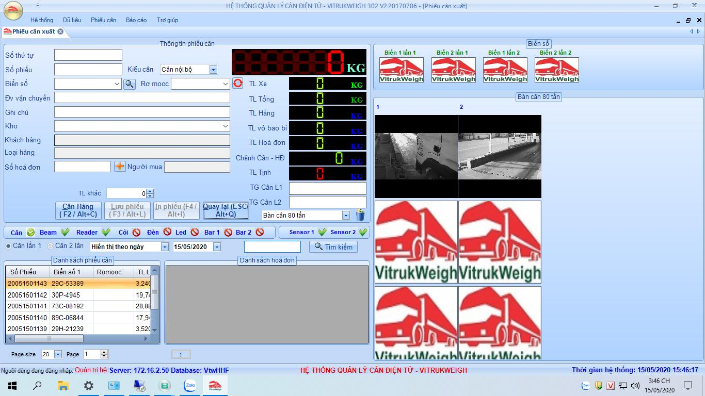
::: danger Chú ý
Khi màn hình hiển thị trọng lượng cân bằng 0 mới được phép tiến hành cân!
:::

### Cân xuất thành phẩm
Việc cân xuất thành phẩm được thực hiện theo quy trình khép kín:
- B1: Lái xe đăng ký vào ở cổng Bảo Vệ.
- B2: Làm đơn hàng.  
Thông tin đơn hàng sẽ được đẩy từ Bravo sang phần mềm cân ACS để đối chiếu thực tế lúc cân.
- B3: Cân bì xe.
- B4: Lái xe đi bốc hàng.
- B5: Cân xe lần 2 để tính trọng lượng hàng đã bốc.
- B6: Lái xe đăng ký ra ở cổng Bảo Vệ.
Sau đây là các bước hướng dẫn cho các bước liên quan tới cân xuất thành phẩm.

#### B3: Cân bì xe
Khi xe đã lên cân ổn định, nhân viên cân ấn nút `Cân hàng`.
Giao diện cân như hình bên dưới:
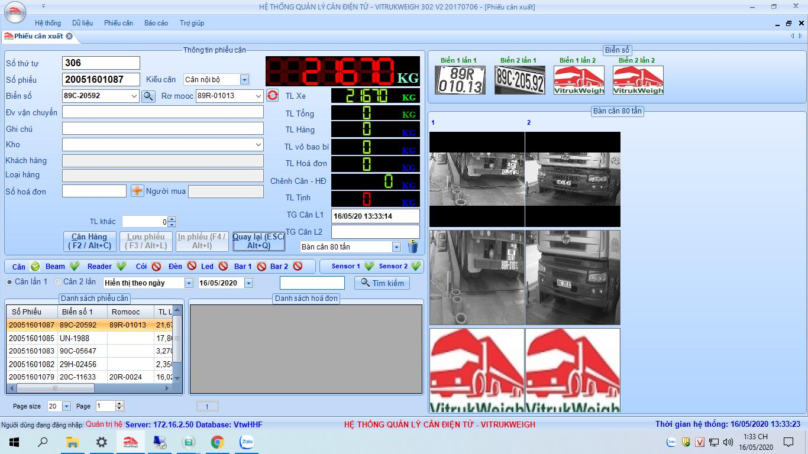
- [Số thứ tự]: số thứ tự xếp lượt của lái xe khi vào lấy hàng.  
Số này được module đăng ký xe xuất tạo ra tự động ở cổng Bảo Vệ.
- [Số phiếu]: số phiếu cân. Số này được tạo ra tự động bởi phần mềm cân ACS.
- [Kiểu cân]: khi cân xuất thành phẩm thì chọn là `Cân nội bộ`.  
Trường hợp cân xuất nguyên liệu sản xuất hoặc cân phế liệu ... thì chọn kiểu cân `Cân khác`.
- [Biển số], [Rơ mooc]: biển số xe đang trên bàn cân.  
::: warning Chú ý
Biển số này bình thường sẽ được phần mềm nhận diện tự động qua camera.  
Tuy nhiên, một số trường hợp do biển số xe bị bẩn, bị mờ hoặc bị che khuất thì biển số này có thể không hiện ra hoặc bị sai giá trị.  
Do vậy, người dùng cần có động tác nhìn biển số ở camera bên phải giao diện và so sánh với biển số nhận dạng ra được.  
Nếu phát hiện bị sai, người dùng cần nhập tay giá trị này hoặc chọn luôn biển số đã đăng ký ở mục `Danh sách phiếu cân`.
:::
::: danger Lỗi xảy ra
Trường hợp xe chưa được đăng ký ở cổng Bảo Vệ hoặc đăng ký sai biển số xe, phần mềm cân sẽ báo lỗi.  
Khi đó người dùng cần liên hệ với Bảo Vệ để đăng ký lại xe, sau đó cân bình thường.
:::
- Khi thông tin `Biển số xe` và `TL xe` (trọng lượng xe) đã ổn định, người dùng ấn nút `Lưu phiếu` để lưu giá trị cân lần 1.
#### B5: Cân xe lần 2 để tính trọng lượng hàng đã bốc.
Giao diện cân lần 2 được thể hiện như hình bên dưới.
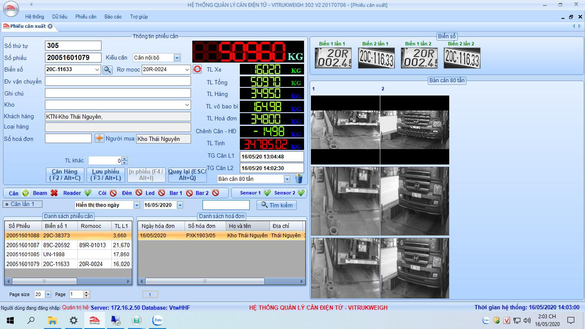
- Khi thông tin `Biển số xe` và `TL xe` đã ổn định, người dùng ấn nút `Cân hàng` và thực hiện việc quẹt các phiếu cân qua máy quét mã vạch.
  * Khi chênh lệch trong giới hạn cho phép, người dùng ấn nút `Lưu phiếu` để hoàn thành việc cân.
  * Khi chênh lệch vượt quá giới hạn, người dùng cần liên hệ với bộ phận Kho hoặc Kế Toán bán hàng để xem lại mức chênh lệch đã hợp lý chưa.  
  Nếu có lý do hợp lý, người dùng cập nhật lý do vào mục `Ghi chú` trên giao diện cân.
- Người dùng ấn nút `In phiếu` và chọn số bản in cần thiết.
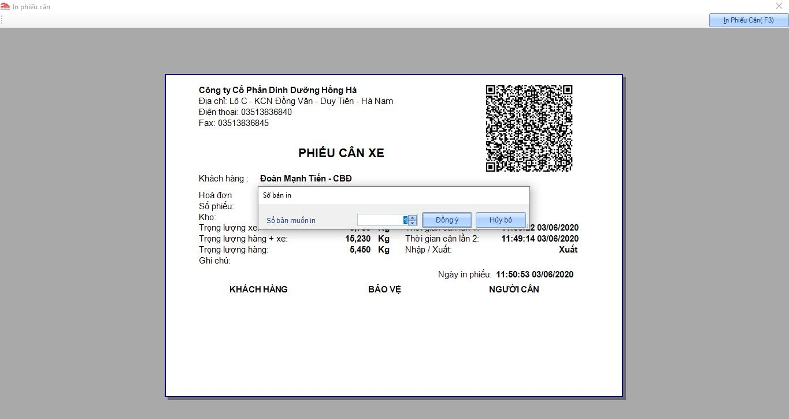
::: warning Chú ý
- Việc tính bì đã được tự động hóa, người dùng chỉ quan tâm tới giá trị chênh lệch giữa cân và hóa đơn `Chênh cân - HĐ`.
- Trường hợp thiết bị quét mã vạch không thể đọc được thông tin (do bị phiếu in bị mờ hoặc bị nhăn), người dùng ấn dấu + ở mục `Số hóa đơn` sau đó nhập `Số hóa đơn` hoặc `Số phiếu xuất kho`.
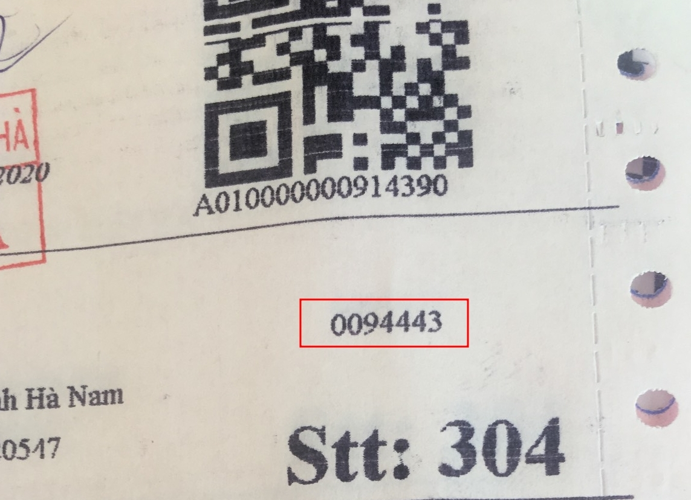
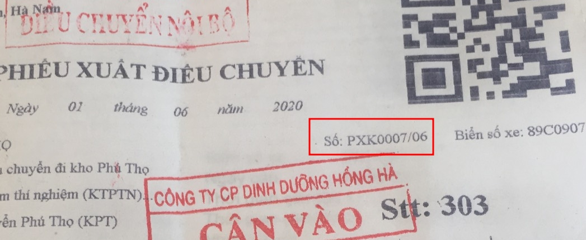
:::
### Cân xuất khác (cân nguyên liệu sản xuất, cân bán phế liệu ...)
Thực hiện tương tự như `Cân nội bộ`.
- Cân lần 1: người dùng ấn `Cân hàng(F2)` > chọn kiểu `Cân khác`> nhập thông tin cần thiết như: `Khách hàng`, `Loại hàng`, `Ghi chú`..vv > ấn `Lưu phiếu(F3)`.
- Cân lần 2: `Cân hàng(F2)` > `Lưu phiếu(F3)` > `In phiếu(F4)`.
