# Phần mềm Zoom
Zoom là một trong những phần mềm họp trực tuyến phổ biến nhất hiện nay.
Với bản miễn phí, Zoom có những tính năng sau:
- Họp trực tuyến tối đa 100 người.
- Không giới hạn thời gian với cuộc họp 1-1.
- Giới hạn thời gian 40 phút cho cuộc họp nhóm.
## Cài đặt
### Cài trên máy tính
- B1: Tải bộ cài
  * Mở trình duyệt web (Chrome/Firefox/CocCoc...), gõ địa chỉ [zoom.us/download](https://zoom.us/download).
  * Click vào nút `Download` để tải phần mềm về.
  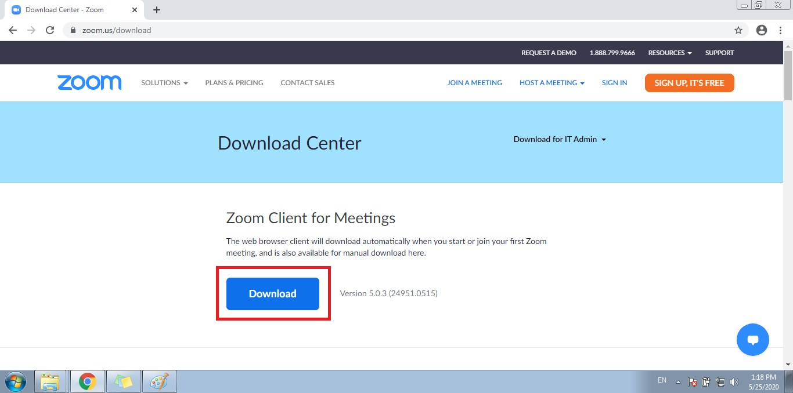
- B2: Tiến hành cài đặt
  * Click đúp vào file chạy đã tải ở trên và ấn `Yes`.
  * Chờ phần mềm cài đặt xong, giao diện phần mềm sẽ hiện lên như hình bên dưới:
  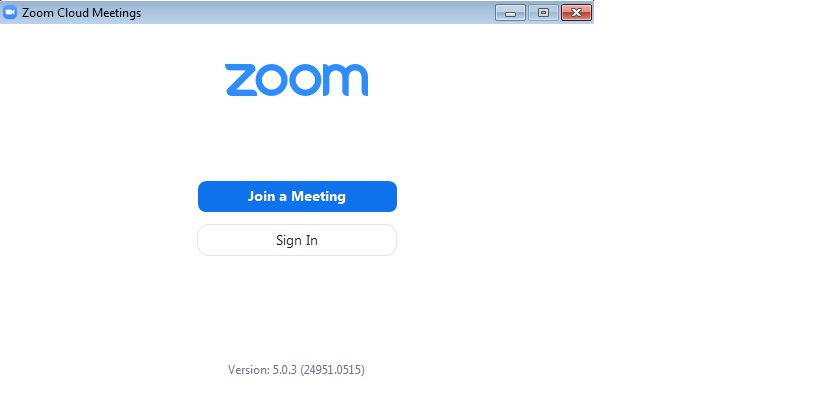

### Cài trên điện thoại di động
Người dùng mở kho ứng dụng phần mềm (AppStore hoặc CHPlay), gõ từ khóa `Zoom`.  
Sau đó tìm phần mềm tên `Zoom Cloud Meetings` và tiến hành cài đặt.

## Cách sử dụng
### Chủ cuộc họp (Host)
Để cuộc họp diễn ra trên phần mềm Zoom, cần phải khởi tạo cuộc họp - `host the meeting`.  
Cuộc họp được khởi tạo bởi 1 người, thường là người chủ của cuộc họp.
- Yêu cầu: việc khởi tạo cuộc họp bắt buộc người dùng phải đăng ký thông tin với phần mềm Zoom.
Việc đăng ký (miễn phí) có thể bằng tài khoản email, tài khoản Google hoặc tài khoản Facebook.
Dưới đây là hướng dẫn cho việc đăng ký bằng email.
  * B1: Mở phần mềm Zoom, click vào nút `Sign in`.
  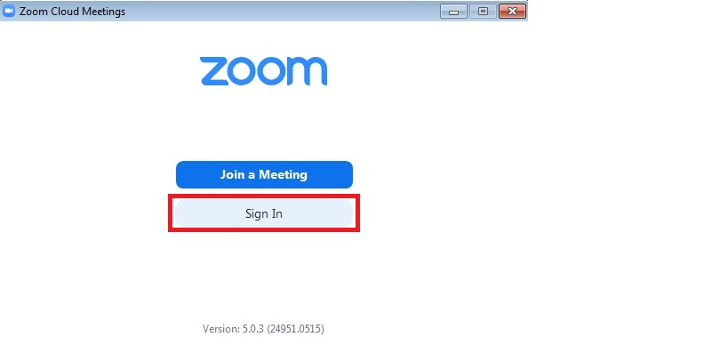
  * B2: Ấn nút `Sign up free`, trang web đăng ký sẽ mở ra và yêu cầu bạn điền thông tin ngày sinh.
  Bạn điền đầy đủ ngày - tháng - năm và ấn nút `Continue`.
  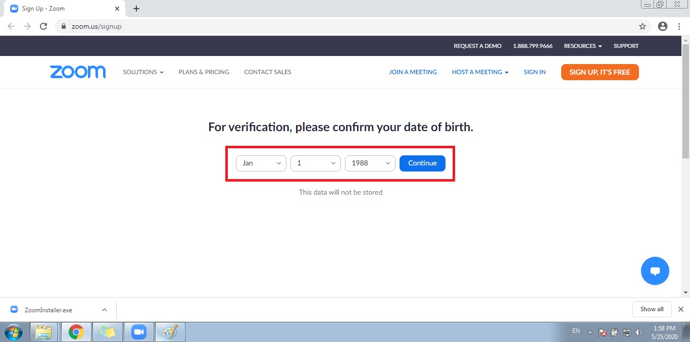
  ::: tip
  Thông tin ngày sinh không nhất thiết phải đúng với thực tế!
  :::
  * B3: Điền thông tin email (sử dụng email công ty), sau đó ấn nút `Sign up`.  
  Phần mềm sẽ gửi 1 thư tới địa chỉ email đăng ký và yêu cầu xác nhận thông tin tài khoản.
  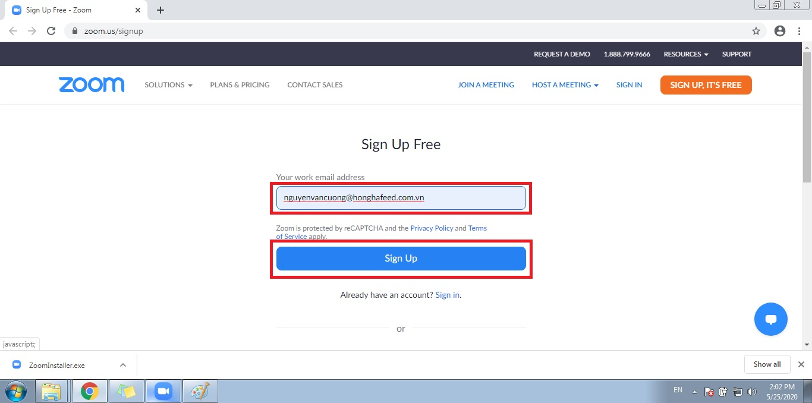
  * B4: Bạn mở email của mình ra (email đã đăng ký với phần mềm Zoom), sau đó click vào `Activate Account` màu xanh.
  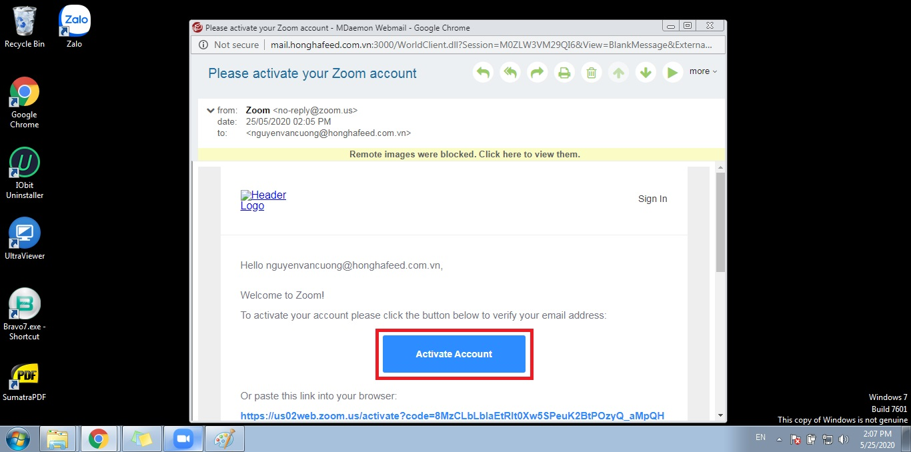
  * B5: Xác nhận thông tin KHÔNG phải là trường học bằng cách chọn `No` và ấn `Continue`.
  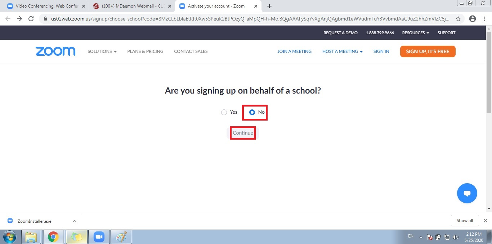
  * B6: Nhập họ, tên và mật khẩu.
  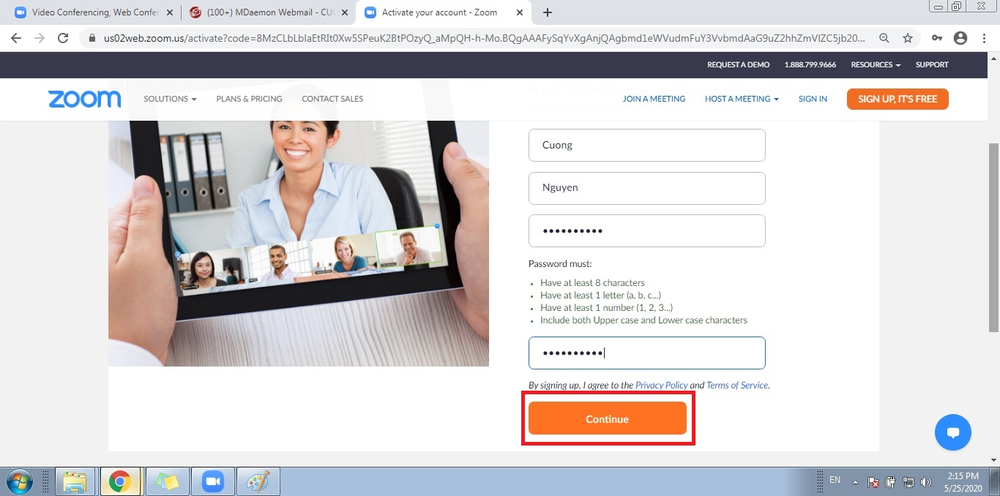
  ::: warning
  Mật khẩu phải đủ mạnh: dài ít nhất 8 ký tự, bao gồm Chữ HOA + Chữ thường + Số + Ký tự đặc biệt.
  :::
- Đăng nhập: sau quá trình đăng ký thành công, bạn nhập với email và mật khẩu tại giao diện phần mềm, tick vào nút `Keep me signed in` rồi ấn nút `Sign in`.
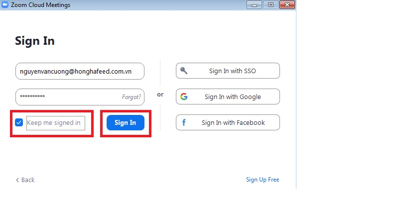
### Người tham gia (Client)
Người tham gia không cần phải đăng ký tài khoản Zoom.  
Muốn tham gia vào một cuộc họp nào đó, người tham gia (Client) chỉ cần biết ID và Password của cuộc họp.

## Tạo cuộc họp
### Tạo ngay 1 cuộc họp
- B1: Click vào biểu tượng `New Meeting`
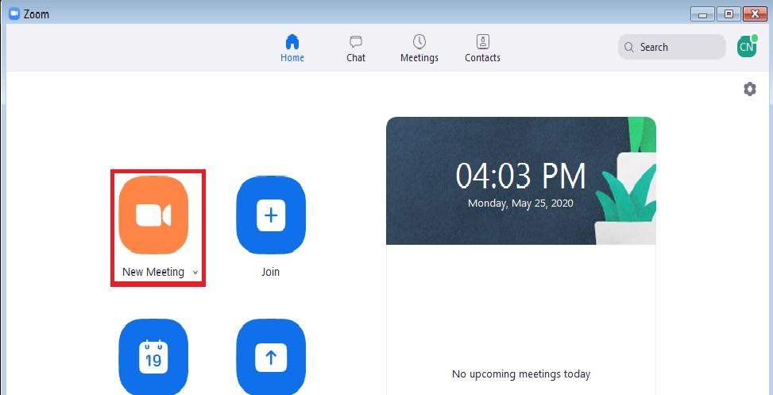
- B2: Bật audio cho cuộc họp
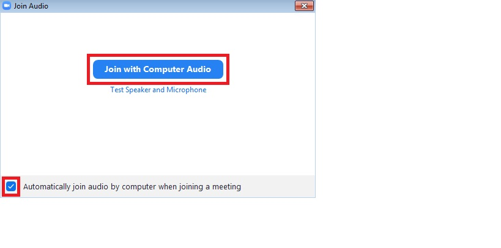
- B3: Mời người tham gia cuộc họp
Để mời người khác, bạn click vào chữ `Participants` > Click tiếp `Invite`, sau đó 1 giao diện phần mềm sẽ hiện lên.
Giao diện này bao gồm:
  * ID của cuộc họp (Dãy số trên cùng).
  * Password của cuộc họp (`Meeting password` dưới cùng bên phải).
  * Nút cho phép copy đường link cuộc họp và chia sẻ.
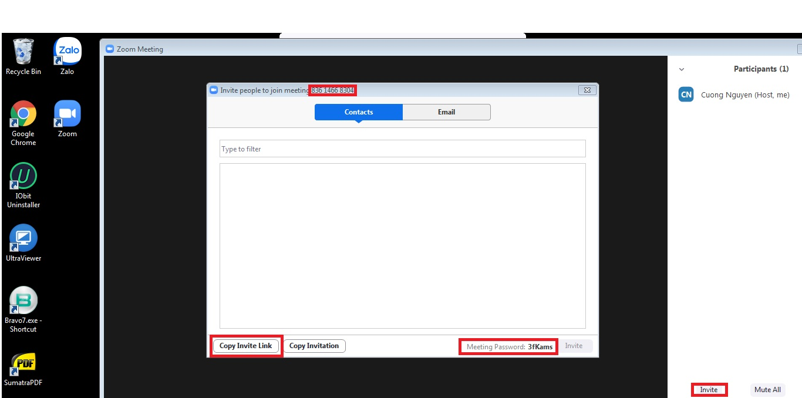
Người tạo cuộc họp có thể mời người tham gia bằng 2 cách:
  * Gửi ID và Password của cuộc họp.
  * Gửi đường link cuộc họp.
### Tạo cuộc họp theo lịch

## Tham gia vào cuộc họp